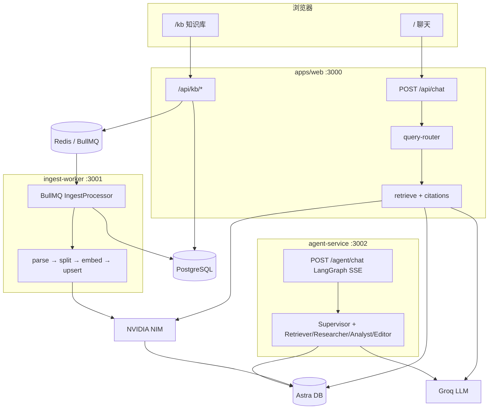

# Personal GPT

基于 Next.js 的个性化智能对话应用：RAG（检索增强生成）+ Astra 向量库 + 可自助管理的知识库（`/kb`），回答可溯源引用。

当前基线：**v3.0 已关账**（混合检索 · 记忆 · Graph demo · 意图路由 · Phase 3.1 UAT）。下一步 **v4.0**（Graph KB 产品化 + 身份治理 + 可生产部署）。详见下方 [产品路线图](#产品路线图-product-roadmap) 与 [仓库内文档](#仓库内文档)。

[在线演示](https://personal-emotion-gpt.vercel.app)

## 界面预览

<p align="center">
  
</p>

<p align="center">
  
  &nbsp;
  
</p>

<p align="center"><sub>上：聊天首页 · 下左：知识库 /kb · 下右：移动端</sub></p>

## 架构总览



## 特性

- **语义检索**：Astra DB 或 Milvus ANN + NVIDIA NIM 2048 维 embedding（`query` / `passage` 分离）
- **混合检索（v3）**：`packages/shared` 的 `hybridSearch` — 向量 + Elasticsearch BM25 + RRF，可选 rerank / Corrective
- **Corpus 分库**：`user` / `seed` 物理 collection 隔离（默认 Chat 只查 user corpus；seed 用于预设问答与 Graph demo）
- **意图路由（v3.1）**：Chat 与 Agent 共用 `packages/shared/src/routing/`（L0/L1 + `IntentPlan`）；`graph_relation` 等确定性走 `graph_search`
- **三层查询路由（Chat）**：意图快路径 → embedding Top-1 预检 → Groq LLM 二分类（灰色地带倾向检索）
- **流式回答 + 引用卡片**：Vercel AI SDK `data-citations`；流结束后展示标题 / 相似度 / snippet
- **知识库管理**：`/kb` 上传 PDF·MD·TXT·DOCX，BullMQ 异步 parse→split→embed→upsert，SSE 进度
- **Monorepo**：`apps/web` · `apps/ingest-worker` · `apps/agent-service` · `packages/shared`
- **限流（可选）**：Upstash Redis；未配置时 fail-open
- **响应式 UI**：聊天 + `/kb` 共用品牌导航

## 技术栈

| 层级           | 选型                                                                     |
| -------------- | ------------------------------------------------------------------------ |
| Web            | Next.js 16.2 · React 19 · Tailwind CSS 4                                 |
| AI             | Vercel AI SDK 6 · `@ai-sdk/openai-compatible`（Groq OpenAI 兼容端点）    |
| 聊天模型       | Groq：`qwen/qwen3.6-27b` → `openai/gpt-oss-120b` → `openai/gpt-oss-20b`  |
| Embedding      | NVIDIA NIM `nvidia/llama-nemotron-embed-1b-v2`（2048 维）                |
| 向量库         | DataStax Astra DB（默认）；可选 Milvus（`VECTOR_BACKEND=milvus`）        |
| 检索增强（v3） | Elasticsearch BM25 · Neo4j Graph RAG（seed demo）· Redis 短期记忆 · Mem0 |
| 元数据 / 队列  | PostgreSQL 16 + TypeORM 0.3 · Redis 7 + BullMQ 5                         |
| Worker / Agent | NestJS 11（ingest-worker :3001 · agent-service :3002）                   |
| 质量           | TypeScript · Zod · Vitest · ESLint · Prettier                            |
| 切块           | `@langchain/textsplitters`（ingest-worker + 部分 seed 脚本）             |

> 聊天与 Agent 默认栈：**Groq + NIM + Astra**；混合检索 / Graph 需本地 `docker compose` 拉起 ES、Neo4j 等（见 `.env.example`）。

## 前置要求

- Node.js **22**（与 CI 一致；本地建议 ≥ 20）
- Yarn（Yarn Workspaces monorepo）
- [DataStax Astra DB](https://astra.datastax.com/) 账户
- [Groq API Key](https://console.groq.com/keys)（`GROQ_API_KEY`）
- [NVIDIA NIM API Key](https://build.nvidia.com/)（`NIM_API_KEY`）
- 使用 `/kb` 时还需 [Docker](https://docs.docker.com/get-docker/)（本地 PostgreSQL + Redis）

## 快速开始

### 1. 克隆并安装

```bash
git clone https://github.com/moyunzero/personal-gpt.git
cd personal-gpt
yarn install
```

### 2. 配置环境变量

```bash
cp .env.example .env
```

至少填写：

| 变量                                                                                                  | 获取                                                   |
| ----------------------------------------------------------------------------------------------------- | ------------------------------------------------------ |
| `ASTRA_DB_API_ENDPOINT` / `ASTRA_DB_APPLICATION_TOKEN` / `ASTRA_DB_COLLECTION` / `ASTRA_DB_NAMESPACE` | [Astra Portal](https://astra.datastax.com/) → Connect  |
| `GROQ_API_KEY`                                                                                        | [console.groq.com/keys](https://console.groq.com/keys) |
| `NIM_API_KEY`                                                                                         | [build.nvidia.com](https://build.nvidia.com/)          |

所有 app 共用仓库根目录 `.env`。

### 3. 初始化 Astra 向量集合（首次）

```bash
yarn astra:init-embedding
```

创建与 NIM 对齐的 **2048 维** collection；已存在则跳过。

### 4. 导入预设知识（可选）

```bash
# 个人/项目介绍类（source=prompt-suggestion，与检索 Path A 对齐）
yarn seed:suggestions

# 心理学问答（source=psychology-qa；数据量大，可配 LOAD_LIMIT / EMBED_BATCH_SIZE）
# LOAD_LIMIT=100 EMBED_BATCH_SIZE=8 yarn seed:psychology

# 网页抓取入库（需 ASTRA_DB_NAMESPACE）
# yarn seed

# 将 v0.1 遗留数据迁入 PG（向量 source 为 legacy-*，与日常 seed 不同）
# yarn migrate:legacy
```

### 5. 启动开发服务

#### 方案 A — 仅聊天（最小）

```bash
yarn dev:web
```

打开 [http://localhost:3000](http://localhost:3000)。RAG 走 Astra，不依赖本地 Docker。

#### 方案 B — 完整 v1.0（含 `/kb`）

需要 PostgreSQL（文档元数据）与 Redis（BullMQ）。`yarn docker:up` 还会启动 Elasticsearch、Milvus、Neo4j（Phase 3 混合检索 / Graph demo 可选依赖）：

```bash
yarn docker:up

# 首次迁移（在仓库根目录执行）
DOTENV_CONFIG_PATH=../../.env yarn workspace web migration:run

# 两个终端
yarn dev:web      # → http://localhost:3000
yarn dev:worker   # → :3001，消费入库队列
```

知识库页：[http://localhost:3000/kb](http://localhost:3000/kb)

确认 `.env` 中 `DATABASE_URL` / `REDIS_URL` 与 `docker-compose.yml` 一致（见 `.env.example` 默认值）。

#### 方案 C — Agent 多 Agent（v2.0 MVP）

```bash
yarn dev:agent    # AGENT_SERVICE_PORT 默认 3002 → POST /agent/chat
yarn acceptance:phase-2-smoke   # live SSE：KB 命中 + 主链路门禁（需 embedding/Astra）
```

说明：浏览器经 Next BFF `/api/agent/chat` 转发；服务端上游基址为 `AGENT_SERVICE_URL`（默认 `http://localhost:3002`）。v2.0 为 **MVP 关账 / 可演示**，不是生产就绪（无鉴权多租户、无 agent Docker）。关账与证据见 `tests/acceptance/phase-2-agent/`。

> 联网搜索断言：若要验证真实 web_search / Bocha 结果，需配置 `BOCHA_API_KEY`；未配置时相关断言视为可选跳过，embedding / Astra 等 KB 前置条件仍须满足。

#### 方案 D — Phase 3 回归 / 评测（可选）

```bash
yarn test:regression:phase-3    # hybrid / corpus / memory / graph / intent
yarn eval:phase-3               # 黄金集 smoke
```

验收说明（仓库内）：[`tests/acceptance/phase-3/ACCEPTANCE.md`](./tests/acceptance/phase-3/ACCEPTANCE.md) · [`tests/acceptance/phase-3.1/MCP-ACCEPTANCE.md`](./tests/acceptance/phase-3.1/MCP-ACCEPTANCE.md)

## 项目结构

```text
personal-gpt/
├── apps/
│   ├── web/                 # Next.js — 聊天 UI、/api/chat、/kb、TypeORM、BullMQ producer
│   ├── ingest-worker/       # NestJS — BullMQ consumer（parse→split→embed→upsert）
│   └── agent-service/       # NestJS — LangGraph 多 Agent SSE（:3002）
├── packages/
│   └── shared/              # 类型、env Zod、Groq/NIM、VectorStore、队列常量
├── script/                  # Astra 初始化、seed、repair 等根级脚本
├── apps/web/script/         # migrateLegacy、KB 迁移辅助
├── tests/
│   ├── regression/phase-1|2|3/   # Vitest 回归（PR 建议跑 test:regression）
│   ├── eval/phase-3/             # 黄金集评测
│   └── acceptance/               # 各阶段验收说明（ACCEPTANCE / CLOSEOUT / MCP-ACCEPTANCE）
├── assets/readme/           # README 截图
├── docker-compose.yml       # PG + Redis + ES + Milvus + Neo4j
├── .env.example
└── package.json             # Yarn workspaces 根脚本
```

## 核心功能说明

### 查询路由与 RAG

Chat 检索落在 `apps/web/lib/chat/`（`query-router.ts` · `retrieve.ts`），底层统一调用 `packages/shared` 的 `hybridSearch`：

| 路由       | 含义            | 行为                                                        |
| ---------- | --------------- | ----------------------------------------------------------- |
| `direct`   | 通用知识 / 闲聊 | 不检索，模型直接答；不发 citations                          |
| `retrieve` | 需要私有资料    | hybridSearch → 有命中则注入 context + 流末 `data-citations` |

**三层路由**（`query-router.ts`）：

1. **意图快路径**：寒暄、算式
2. **embedding 预检**：Top-1 ≥ `ROUTE_RETRIEVE_SIMILARITY`（默认 0.68）→ retrieve；&lt; `ROUTE_DIRECT_SIMILARITY`（默认 0.42）→ direct
3. **LLM 路由器**：灰色地带由 Groq `openai/gpt-oss-20b` 二分类（可用 `ENABLE_LLM_QUERY_ROUTER=false` 关闭）

**可选增强**（见 `rag-options.ts`；v3 管道内 rerank 另有 env 控制）：

- `ENABLE_HYDE` / `ENABLE_MULTI_QUERY` / `ENABLE_RERANKER`（Chat 层开关，默认关）

### 检索与阈值（代码默认值）

| 项             | 默认                                    | 说明                                              |
| -------------- | --------------------------------------- | ------------------------------------------------- |
| 默认 corpus    | `user`                                  | Chat 默认只查用户库；`seed` 须显式传入            |
| Path A 门槛    | `TOP1_SIMILARITY_THRESHOLD=0.55`        | embedding 预检（user 路径）                       |
| Path B 门槛    | `SEED_CORPUS_SIMILARITY_THRESHOLD=0.72` | embedding 预检（seed 路径）                       |
| Top-K          | `RETRIEVAL_LIMIT=5`                     | 最终注入条数                                      |
| 硬超时         | `VECTOR_SEARCH_TIMEOUT_MS=12000`        | 超时后再有固定 10s 宽限期（`RETRIEVAL_GRACE_MS`） |
| Embedding 缓存 | `EMBEDDING_CACHE_SIZE=100`              | 进程内 LRU                                        |
| 聊天限流       | 10 req / 60s                            | Upstash；未配置则放行                             |
| KB 限流        | 30 req / 60s                            | 同上                                              |

## 可用脚本

根目录（`yarn <script>`）：

```bash
# 开发
yarn dev:web                 # Next.js → :3000
yarn dev:worker              # ingest-worker → :3001
yarn dev:agent               # agent-service → :3002

# 基础设施
yarn docker:up               # PostgreSQL + Redis

# Astra / 数据
yarn astra:init-embedding
yarn seed:suggestions
yarn seed:psychology
yarn seed
yarn migrate:legacy          # v0.1 → PG（legacy-* source）

# 质量
yarn test
yarn test:regression
yarn test:regression:phase-3
yarn eval:phase-3
yarn acceptance:phase-1
yarn acceptance:phase-2-smoke
yarn validate                # format + lint + 各 workspace validate
yarn lint
yarn format
```

Web workspace：

```bash
yarn workspace web build
yarn workspace web start
DOTENV_CONFIG_PATH=../../.env yarn workspace web migration:run
yarn workspace web migrate:kb    # Vercel build 用的幂等建表脚本
```

## 部署

### Vercel（web）

1. 推送代码到 GitHub，在 [Vercel](https://vercel.com) 导入本仓库
2. **Root Directory** 设为 `apps/web`（Settings → Build and Deployment）
3. 环境变量至少：`GROQ_API_KEY`、`NIM_API_KEY`、`ASTRA_DB_*`；启用知识库还需可达的 `DATABASE_URL`、`REDIS_URL`（及常驻的 ingest-worker，**不能**只靠 Vercel Serverless）
4. 保存后手动 Redeploy 一次

> `apps/web` 的 `build` 会跑 `script/run-kb-migrations.mjs`（有 `DATABASE_URL` 时幂等建表）。ingest-worker / agent-service 需另外部署（Docker / VPS 等），见路线图 v4.0。

### 其他平台

需支持 Next.js 16+ 与 Node.js 22（或兼容的 20+），并正确配置根目录环境变量。

## 环境变量说明

### 聊天运行时必需

| 变量                         | 说明                            |
| ---------------------------- | ------------------------------- |
| `ASTRA_DB_API_ENDPOINT`      | Astra Data API 端点             |
| `ASTRA_DB_APPLICATION_TOKEN` | 访问令牌                        |
| `ASTRA_DB_COLLECTION`        | 2048 维 collection 名           |
| `ASTRA_DB_NAMESPACE`         | Keyspace（seed / 部分脚本需要） |
| `GROQ_API_KEY`               | 聊天 + RAG 辅助                 |
| `NIM_API_KEY`                | Embedding                       |

### 知识库 / Worker

| 变量                 | 说明                                                   |
| -------------------- | ------------------------------------------------------ |
| `DATABASE_URL`       | PostgreSQL（`/kb` CRUD、ingest_jobs）                  |
| `REDIS_URL`          | BullMQ                                                 |
| `UPLOAD_MAX_BYTES`   | 上传上限，默认 `20971520`（20MB）                      |
| `INGEST_WORKER_PORT` | 默认 `3001`                                            |
| `AGENT_SERVICE_URL`  | BFF → agent-service 基址，默认 `http://localhost:3002` |
| `AGENT_SERVICE_PORT` | agent-service 监听端口，默认 `3002`                    |

### 可选

| 变量                                                            | 默认                | 说明                   |
| --------------------------------------------------------------- | ------------------- | ---------------------- |
| `VECTOR_SEARCH_TIMEOUT_MS`                                      | `12000`             | 检索硬超时（ms）       |
| `EMBEDDING_CACHE_SIZE`                                          | `100`               | embedding LRU          |
| `UPSTASH_REDIS_REST_URL` / `TOKEN`                              | —                   | 限流；未配则关闭       |
| `ENABLE_LLM_QUERY_ROUTER`                                       | 开（除非 `=false`） | LLM 路由兜底           |
| `ENABLE_EMBEDDING_ROUTE_PRECHECK`                               | 开（除非 `=false`） | embedding 预检         |
| `ROUTE_RETRIEVE_SIMILARITY`                                     | `0.68`              | 预检 → retrieve        |
| `ROUTE_DIRECT_SIMILARITY`                                       | `0.42`              | 预检 → direct          |
| `SEED_CORPUS_SIMILARITY_THRESHOLD`                              | `0.72`              | psychology seed 门槛   |
| `ENABLE_HYDE` / `ENABLE_MULTI_QUERY` / `ENABLE_RERANKER`        | `false`             | 高级 RAG               |
| `LANGSMITH_API_KEY` / `LANGSMITH_TRACING` / `LANGSMITH_PROJECT` | 关                  | 追踪（fail-open）      |
| `GOOGLE_GENERATIVE_AI_API_KEY`                                  | —                   | 备用；当前默认栈未使用 |

完整注释见 [`.env.example`](./.env.example)。

## 仓库内文档

以下文件**在 Git 仓库中可访问**（产品与开发笔记目录 `docs/`、GSD 目录 `.planning/` 为本地 gitignore，克隆后不在仓库内，故不在此列出）。

| 文档                                                                                           | 说明                                   |
| ---------------------------------------------------------------------------------------------- | -------------------------------------- |
| [AGENTS.md](./AGENTS.md)                                                                       | 本仓库 Agent / 贡献约定                |
| [.env.example](./.env.example)                                                                 | 环境变量说明（含 v3 混合检索 / Neo4j） |
| [tests/acceptance/phase-1/ACCEPTANCE.md](./tests/acceptance/phase-1/ACCEPTANCE.md)             | Phase 1 验收                           |
| [tests/acceptance/phase-2-agent/CLOSEOUT.md](./tests/acceptance/phase-2-agent/CLOSEOUT.md)     | Phase 2 / v2.0 MVP 关账                |
| [tests/acceptance/phase-2-agent/README.md](./tests/acceptance/phase-2-agent/README.md)         | Phase 2 验收与 smoke 说明              |
| [tests/acceptance/phase-3/ACCEPTANCE.md](./tests/acceptance/phase-3/ACCEPTANCE.md)             | Phase 3 验收                           |
| [tests/acceptance/phase-3/MCP-ACCEPTANCE.md](./tests/acceptance/phase-3/MCP-ACCEPTANCE.md)     | Phase 3 Playwright MCP 记录            |
| [tests/acceptance/phase-3.1/MCP-ACCEPTANCE.md](./tests/acceptance/phase-3.1/MCP-ACCEPTANCE.md) | Phase 3.1 意图路由 UAT                 |

## 产品路线图 (Product Roadmap)

**愿景**：从个人 RAG 聊天原型演进为可生产、多租户、可观测的企业级知识库平台（对标头部产品的权限感知检索 + 混合 RAG + 可私有化交付）。

**架构原则**

- Chat（稳定问答）与 Agent（研究型任务）双模并存
- 检索质量与评测优先于再堆子 Agent（v3）；身份与 ACL 优先于连接器（v4）
- 异步导入：BullMQ + Redis；元数据：PostgreSQL；向量：Astra（v3 扩展混合检索 / 多存储）
- 生产治理集中在 v4；连接器与 HITL 在 v5

### v0.1 — RAG 聊天原型（已完成）

单页聊天、`POST /api/chat`、Astra 检索、Groq 多模型 fallback、seed 脚本、基础 CI。

历史边界（无 `/kb`、无 citation）已由 v1.0 覆盖。

### v1.0 — RAG 强化与知识库管理（已封板 ✅）

| 模块      | 状态                                                           |
| --------- | -------------------------------------------------------------- |
| 基础设施  | ✅ Monorepo + Docker Compose + BullMQ Worker                   |
| 数据模型  | ✅ `workspaceId` 全链路（UI 仍为单 workspace）                 |
| 文档导入  | ✅ PDF/MD/TXT/DOCX                                             |
| 知识库 UI | ✅ `/kb` 上传 / 列表 / 筛选 / CRUD / SSE 进度                  |
| RAG       | ✅ 引用 + 三层路由 + 双路检索 + 可选 HyDE/Multi-Query/Reranker |
| 工程      | ✅ CI + 回归 + Playwright 验收 8/8 + LangSmith（可选）         |

**仍未做（v4+）**：用户认证、聊天历史持久化、多 workspace UI、权限感知 ACL 检索、agent 全栈 Docker。

**演示**：[https://personal-emotion-gpt.vercel.app](https://personal-emotion-gpt.vercel.app) · [GitHub](https://github.com/moyunzero/personal-gpt)

### v2.0 — LangGraph 多 Agent ⚠️ MVP 关账（非生产就绪）

| 模块           | 状态                                                     |
| -------------- | -------------------------------------------------------- |
| Agent 多 Agent | ⚠️ LangGraph Supervisor + SSE + 步骤面板（v2.0 **MVP**） |

Nest.js Agent + Supervisor / 子 Agent、Skills、前端步骤可视化。简单聊天仍走 `/api/chat`。  
证据：人工截图 + `yarn acceptance:phase-2-smoke`（KB 命中 live citation）→ `tests/acceptance/phase-2-agent/`。

**验收口径**：主链路可演示、可回归；v2.x blocker 已在加固轮次收口（见 [`CLOSEOUT.md`](./tests/acceptance/phase-2-agent/CLOSEOUT.md)）。仍 **≠ 生产就绪**（无鉴权多租户、无 agent Docker）。

**v2.x（2026-08-14 → 2026-08-21）**：配额按 thread 隔离、模型默认值修复、checkpointer 单例、body Zod、可选内部令牌 + `/api/agent/chat` BFF；流式去重与消毒；Agent KB 查询压缩 + 默认相似度门槛 0.60。

**v2 收口**：不再扩办事型工具。

### v3.0 — 检索可信度 + 记忆 + 评测 ✅

对标 RAGFlow/FastGPT「答得准」：混合检索、Corrective RAG、黄金集评测、Redis/Mem0 记忆、Milvus/ES、Neo4j Graph demo、Phase 3.1 统一意图路由。  
证据：[`tests/acceptance/phase-3/ACCEPTANCE.md`](./tests/acceptance/phase-3/ACCEPTANCE.md) · `yarn test:regression:phase-3` · `yarn eval:phase-3`。  
**已知缺口（v4 补齐）**：Postgres 多实例 checkpointer、权限感知检索、应用级 Graph KB、agent 全栈 Docker。

### v4.0 — Graph KB + 身份治理 + 可生产部署 🔜

对标 MaxKB 私有化交付 + Copilot 权限裁剪 + Glean 知识边界：**Wave 0** 用户文档自动构图；**Wave 1** Auth、RBAC、ACL 过滤检索、全栈 Docker（含 agent）、Postgres checkpointer、会话历史、审计。

### v5.0 — 连接器 Lite / HITL / 谨慎行动

对标 Glean·Dify 浅层子集：1–2 个只读连接器、人机确认、工具白名单；语音/定时为 P2。

---

**当前进度**：**v3.0 + Phase 3.1 已关账** → 下一步 **v4.0（Graph KB 产品化 + 身份 / 部署）**。验收与关账证据见上方 [仓库内文档](#仓库内文档)。

## 贡献

欢迎提交 Issue 和 Pull Request。

## 许可证

[MIT](LICENSE)

## 致谢

- [Next.js](https://nextjs.org/)
- [Vercel AI SDK](https://sdk.vercel.ai/)
- [Groq](https://console.groq.com/)
- [NVIDIA NIM](https://build.nvidia.com/)
- [DataStax Astra DB](https://www.datastax.com/)
- [NestJS](https://nestjs.com/)
- [BullMQ](https://docs.bullmq.io/)

---

Made with care by [MoYun](https://github.com/moyunzero)
