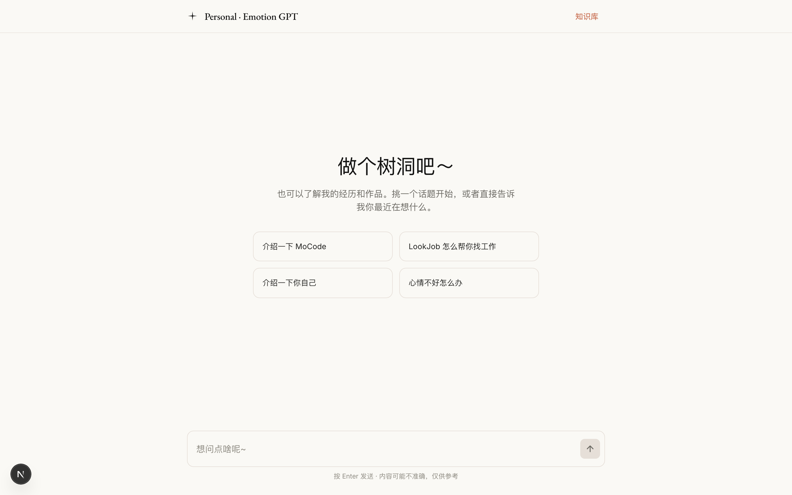
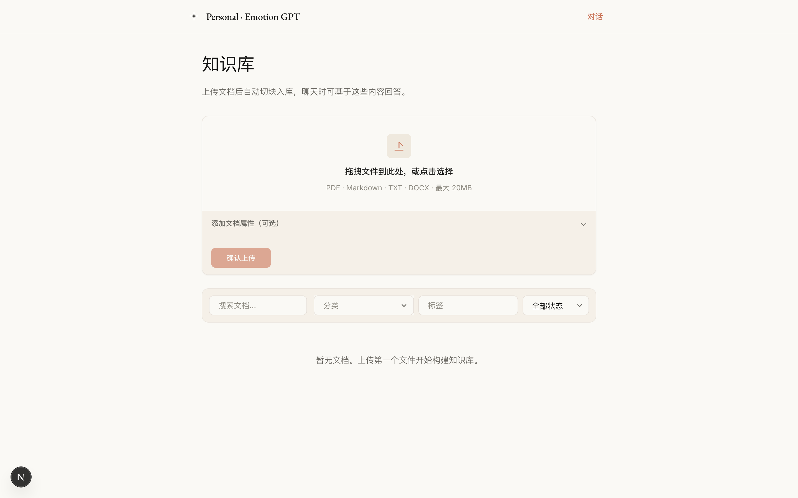
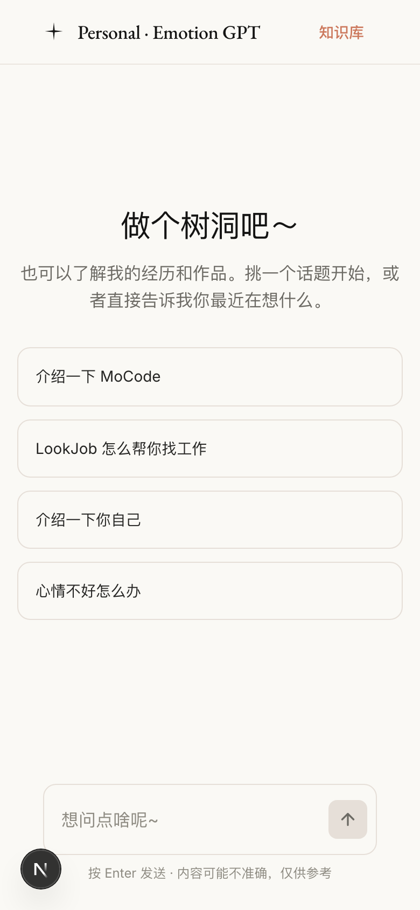
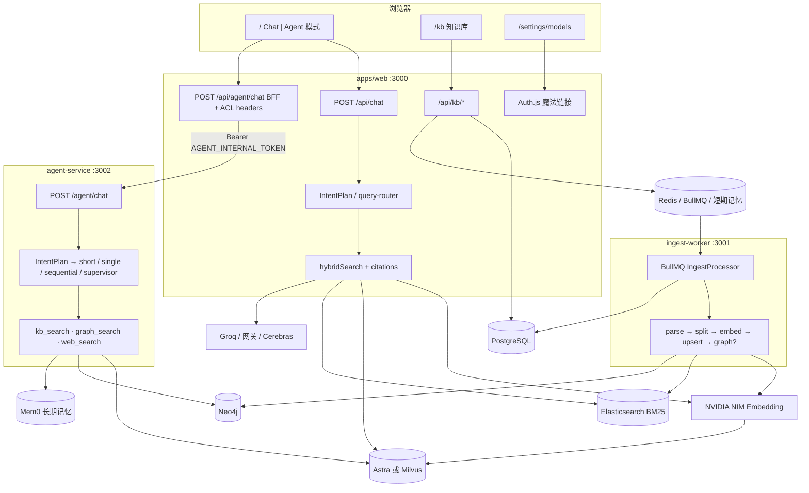

# Personal GPT

企业知识库问答平台：文档自助入库、混合 RAG（向量 + BM25）、Neo4j Graph RAG、LangGraph 多 Agent，回答可溯源引用，并按 Workspace / 文档 ACL 隔离。

当前基线：**v4.0 Wave 0–1 与 Phase 5.1 可用性/安全加固已落地**（Auth · ACL · 入库构图 · Compose 全栈 · 监控）。下一阶段见 [产品路线图](#产品路线图-product-roadmap)。

[在线演示](https://personal-emotion-gpt.vercel.app)

## 界面预览

<p align="center">
  
</p>

<p align="center">
  
  &nbsp;
  
</p>

<p align="center"><sub>上：聊天首页 · 下左：知识库 /kb · 下右：移动端</sub></p>

## 架构总览

**为何 Next + Nest：** Web（页面 / Auth / BFF / 简单 Chat）可走 Serverless；入库与 LangGraph Agent 需要常驻进程与长连接 SSE，故拆为 Nest worker / agent-service。共享检索与类型在 `packages/shared`。


```mermaid
flowchart TB
  subgraph Client["浏览器"]
    Chat["/ Chat | Agent 模式"]
    KB["/kb 知识库"]
    Settings["/settings/models"]
  end

  subgraph Web["apps/web :3000"]
    Auth["Auth.js 魔法链接"]
    ChatAPI["POST /api/chat"]
    AgentBFF["POST /api/agent/chat BFF + ACL headers"]
    KbAPI["/api/kb/*"]
    Router["IntentPlan / query-router"]
    Retrieve["hybridSearch + citations"]
  end

  subgraph Worker["ingest-worker :3001"]
    Proc["BullMQ IngestProcessor"]
    Pipe["parse → split → embed → upsert → graph?"]
  end

  subgraph Agent["agent-service :3002"]
    AgentSSE["POST /agent/chat"]
    Graph["IntentPlan → short / single / sequential / supervisor"]
    Tools["kb_search · graph_search · web_search"]
  end

  PG[(PostgreSQL)]
  Redis[(Redis / BullMQ / 短期记忆)]
  Vec[(Astra 或 Milvus)]
  ES[(Elasticsearch BM25)]
  Neo[(Neo4j)]
  Mem0[(Mem0 长期记忆)]
  LLM[Groq / 网关 / Cerebras]
  NIM[NVIDIA NIM Embedding]

  Chat --> ChatAPI
  Chat --> AgentBFF
  KB --> KbAPI
  Settings --> Auth
  ChatAPI --> Router --> Retrieve
  AgentBFF -->|Bearer AGENT_INTERNAL_TOKEN| AgentSSE
  AgentSSE --> Graph --> Tools
  Retrieve --> NIM
  Retrieve --> Vec
  Retrieve --> ES
  Retrieve --> LLM
  Tools --> Vec
  Tools --> Neo
  Tools --> Mem0
  KbAPI --> PG
  KbAPI --> Redis --> Proc --> Pipe
  Pipe --> NIM --> Vec
  Pipe --> ES
  Pipe --> Neo
  Proc --> PG
```

## 特性

- **双模对话**：Chat（`POST /api/chat`，低延迟 RAG）与 Agent（BFF → Nest LangGraph SSE）手动切换
- **混合检索**：`packages/shared` `hybridSearch` — 向量 ∥ BM25 → RRF → 可选 rerank / Corrective（最多 1 次改写）；ACL `documentIds` **deny-by-default**
- **Corpus 分库**：`user` / `seed` 物理隔离；Chat 默认只查 `user`
- **意图路由**：Chat / Agent 共用 `IntentPlan`（L0/L1 + 可选 L2）；Agent 按 plan 走 short / single_specialist / sequential / supervisor
- **Graph RAG**：入库 LLM 抽实体入 Neo4j + PG `entity_catalog`；查询走 Cypher 模板 + allowlist（不做默认 Text2Cypher）
- **引用卡片**：流结束后 `data-citations`；闲聊不检索、不渲染引用区
- **知识库**：`/kb` 上传 PDF·MD·TXT·DOCX；BullMQ 异步入库；SSE 进度；删文档同步清向量 / ES / 图
- **认证与 ACL**：Auth.js 邮箱魔法链接；Workspace 成员；文档 visibility + 实体级 ACL；Agent 注入 `x-allowed-document-ids`
- **记忆**：Redis 短期（最近 N 轮 + 摘要）；Mem0 仅稳定偏好/事实（禁止全文聊天入库）；Agent Postgres checkpointer
- **模型设置**：`/settings/models` 配置供应商；对话区只切换已配置模型（见 `apps/web/DESIGN.md`）
- **观测**：可选 LangSmith；Compose 含 Prometheus / Grafana；生产 `/metrics` Bearer 鉴权

## 技术栈

| 层级                  | 选型                                                                                               |
| --------------------- | -------------------------------------------------------------------------------------------------- |
| Web                   | Next.js 16.2 · React 19 · Tailwind CSS 4 · Auth.js                                                 |
| AI                    | Vercel AI SDK 6 · `@ai-sdk/openai-compatible`                                                      |
| 聊天模型（默认 Groq） | `qwen/qwen3.6-27b` → `openai/gpt-oss-120b` → `openai/gpt-oss-20b`（可切 OpenAI / 网关 / Cerebras） |
| Embedding             | NVIDIA NIM `nvidia/llama-nemotron-embed-1b-v2`（2048 维）                                          |
| 向量库                | Astra DB（默认）或 Milvus（`VECTOR_BACKEND=milvus`）                                               |
| 检索增强              | Elasticsearch BM25 · Neo4j · Redis 短期记忆 · Mem0                                                 |
| 元数据 / 队列         | PostgreSQL 16 + TypeORM · Redis 7 + BullMQ                                                         |
| Worker / Agent        | NestJS 11（ingest-worker :3001 · agent-service :3002）                                             |
| 对象存储              | 本地 `uploads/` 或 MinIO / Vercel Blob                                                             |
| 质量                  | TypeScript · Zod · Vitest · ESLint · Prettier · 分 phase 回归                                      |

> 最小聊天：**Groq + NIM + Astra**。完整能力需 `yarn docker:up`（见下方方案 B）。

## 前置要求

- Node.js **22**（CI 一致；本地建议 ≥ 20）
- Yarn（Yarn Workspaces）
- [DataStax Astra DB](https://astra.datastax.com/)（或改用 Compose 内 Milvus）
- [Groq API Key](https://console.groq.com/keys)（`GROQ_API_KEY`）
- [NVIDIA NIM API Key](https://build.nvidia.com/)（`NIM_API_KEY`）
- 使用 `/kb`、Agent、Auth、混合检索时需 [Docker](https://docs.docker.com/get-docker/)
- Auth 魔法链接需真实 SMTP（`EMAIL_SERVER` / `EMAIL_FROM`）；`AUTH_SECRET` 生产禁止占位密钥

## 快速开始

### 1. 克隆并安装

```bash
git clone https://github.com/moyunzero/personal-gpt.git
cd personal-gpt
yarn install
```

### 2. 配置环境变量

```bash
cp .env.example .env
```

至少填写（最小 Chat）：

| 变量                                                                                                  | 获取                                                   |
| ----------------------------------------------------------------------------------------------------- | ------------------------------------------------------ |
| `ASTRA_DB_API_ENDPOINT` / `ASTRA_DB_APPLICATION_TOKEN` / `ASTRA_DB_COLLECTION` / `ASTRA_DB_NAMESPACE` | [Astra Portal](https://astra.datastax.com/) → Connect  |
| `GROQ_API_KEY`                                                                                        | [console.groq.com/keys](https://console.groq.com/keys) |
| `NIM_API_KEY`                                                                                         | [build.nvidia.com](https://build.nvidia.com/)          |

完整栈另需：`DATABASE_URL`、`REDIS_URL`、`AUTH_SECRET`、SMTP；图谱 `ENABLE_GRAPH_RAG=true` + `NEO4J_*`；生产 Agent 必设 `AGENT_INTERNAL_TOKEN`。全部变量见 [`.env.example`](./.env.example)。

根目录 `.env` 由各 workspace 共用。

### 3. 初始化 Astra 向量集合（首次，Astra 后端时）

```bash
yarn astra:init-embedding
```

创建与 NIM 对齐的 **2048 维** collection；已存在则跳过。

### 4. 导入预设知识（可选）

```bash
yarn seed:suggestions
# LOAD_LIMIT=100 EMBED_BATCH_SIZE=8 yarn seed:psychology
# yarn seed
# yarn migrate:legacy
```

### 5. 启动开发服务

#### 方案 A — 仅聊天（最小）

```bash
yarn dev:web
```

打开 [http://localhost:3000](http://localhost:3000)。RAG 走 Astra，可不启 Docker。

#### 方案 B — 知识库 + 全栈依赖

`yarn docker:up` 会拉起 PostgreSQL、Redis、Elasticsearch、Milvus、Neo4j、MinIO、Prometheus、Grafana，以及可选的 compose 内 web / agent / ingest（本地开发通常只起基础设施，再本机跑三个 dev 进程）：

```bash
yarn docker:up

DOTENV_CONFIG_PATH=../../.env yarn workspace web migration:run

# 三个终端（按需）
yarn dev:web      # → :3000
yarn dev:worker   # → :3001
yarn dev:agent    # → :3002
```

- 知识库：[http://localhost:3000/kb](http://localhost:3000/kb)
- 模型设置：[http://localhost:3000/settings/models](http://localhost:3000/settings/models)
- 确认 `.env` 中 `DATABASE_URL` / `REDIS_URL` / `NEO4J_URI` 与 compose 一致

图谱：向量写成功后文档即可检索；图谱抽取失败**默认不删向量、不整单重试**（`ENABLE_GRAPH_RAG=true` 时附加构图）。本地建议：

```bash
docker compose up -d neo4j
# NEO4J_URI=bolt://127.0.0.1:7687
```

#### 方案 C — Agent

```bash
yarn dev:agent
yarn acceptance:phase-2-smoke   # live SSE 门禁（需 embedding / 向量库）
```

浏览器经 Next BFF `/api/agent/chat` 转发（`AGENT_SERVICE_URL`，默认 `http://localhost:3002`）。BFF 注入 session ACL；生产要求非空 `AGENT_INTERNAL_TOKEN`。未配 `BOCHA_API_KEY` 时 Researcher 联网降级。

#### 方案 D — 回归 / 评测

```bash
yarn test:regression              # phase-1|2|3（根脚本默认集）
yarn test:regression:phase-4      # Auth / ACL / 构图 / metrics 等
yarn eval:phase-3
yarn eval:citations
yarn eval:corpus
```

评价指标见 [`tests/eval/EVALUATION-STANDARD.md`](./tests/eval/EVALUATION-STANDARD.md)。

## 项目结构

```text
personal-gpt/
├── apps/
│   ├── web/                 # Next.js — UI、Auth、/api/chat、Agent BFF、/kb、settings
│   ├── ingest-worker/       # NestJS — BullMQ：parse→embed→upsert→graph
│   └── agent-service/       # NestJS — LangGraph SSE、tools、IntentPlan 执行图
├── packages/
│   └── shared/              # hybridSearch、routing、graph、memory、VectorStore、env Zod
├── script/                  # Astra 初始化、seed、repair、bench
├── tests/
│   ├── regression/phase-1|2|3|4/
│   ├── eval/
│   └── acceptance/
├── docker/ · docker-compose.yml # 全栈基础设施 + 可选应用服务
├── assets/readme/
├── .env.example
└── package.json
```

## 核心功能说明

### Chat 查询路由与 RAG

实现：`apps/web/lib/chat/`（`query-router.ts` · `retrieve.ts`），底层 `packages/shared` 的 `hybridSearch` / `resolveIntentPlan`。

| 路由       | 行为                                           |
| ---------- | ---------------------------------------------- |
| `direct`   | 不检索；无 citations                           |
| `retrieve` | hybridSearch → context + 流末 `data-citations` |

**路由层次：** 意图快路径 → embedding Top-1 预检（`ROUTE_RETRIEVE_SIMILARITY` / `ROUTE_DIRECT_SIMILARITY`）→ 可选 LLM 二分类（`ENABLE_LLM_QUERY_ROUTER`）→ 与 Agent 共用的 IntentPlan 通道。

可选：`ENABLE_HYDE` / `ENABLE_MULTI_QUERY`（默认关）；管道内 rerank 见 `ENABLE_RERANKER`。

### 检索默认值

| 项             | 默认                                    | 说明                                                     |
| -------------- | --------------------------------------- | -------------------------------------------------------- |
| corpus         | `user`                                  | seed 须显式                                              |
| Path A 门槛    | `TOP1_SIMILARITY_THRESHOLD=0.55`        | user 预检                                                |
| Path B 门槛    | `SEED_CORPUS_SIMILARITY_THRESHOLD=0.72` | seed 预检                                                |
| Top-K          | `RETRIEVAL_LIMIT=5`                     |                                                          |
| 硬超时         | `VECTOR_SEARCH_TIMEOUT_MS=12000`        |                                                          |
| Embedding 缓存 | `EMBEDDING_CACHE_SIZE=100`              | 进程内 LRU                                               |
| Agent KB 门槛  | `AGENT_KB_MIN_SIMILARITY=0.60`          | 低于则 `NO_RELEVANT_HIT`                                 |
| 聊天限流       | 10 req / 60s                            | Upstash；未配 fail-open（游客限流另有 fail-closed 策略） |

命名文档、页码过滤、对比问法、PDF `#page=` 打开等行为见 `apps/web/lib/chat/`。

### Agent 执行模式

`apps/agent-service`：解析 IntentPlan 后选择：

- **short** — 闲聊短路，不全量跑专科
- **single_specialist** — 预检索 + 单专科 / synthesizer 成文
- **sequential** — 确定性流水线（无 Supervisor handoff）
- **supervisor** — hub-and-spoke（计划歧义时）

工具：`kb_search`、`graph_search`、`web_search`、calculator。Skills 为 `skills/*/SKILL.md` 注入，不是子 Agent。

### 入库与图谱

主路径：parse → split → embed → 向量（+ ES 双写）。`ENABLE_GRAPH_RAG=true` 时追加实体抽取 → Neo4j → catalog。图谱失败不毁掉已就绪向量、不因构图失败整单重试。

## 可用脚本

```bash
# 开发
yarn dev:web
yarn dev:worker
yarn dev:agent

# 基础设施
yarn docker:up                 # compose 全栈依赖（及可选应用服务）

# 数据
yarn astra:init-embedding
yarn seed:suggestions
yarn seed:psychology
yarn seed
yarn migrate:legacy
yarn bench:ingest

# 质量
yarn test
yarn test:regression
yarn test:regression:phase-1|2|3|4
yarn eval:phase-3
yarn eval:citations
yarn eval:corpus
yarn acceptance:phase-1
yarn acceptance:phase-2-smoke
yarn validate
yarn lint
yarn format
```

Web workspace：

```bash
yarn workspace web build
yarn workspace web start
DOTENV_CONFIG_PATH=../../.env yarn workspace web migration:run
yarn workspace web migrate:kb
```

## 部署

### Vercel（web）

1. 导入仓库；**Root Directory** = `apps/web`
2. 环境变量：`GROQ_API_KEY`、`NIM_API_KEY`、`ASTRA_DB_*`、`AUTH_SECRET`、SMTP；知识库还需可达的 `DATABASE_URL` / `REDIS_URL`
3. `ingest-worker` 与 `agent-service` **不能**只靠 Vercel Serverless — 用 Compose / VPS / Cloud Run 等常驻部署，并配置 `AGENT_SERVICE_URL`、`AGENT_INTERNAL_TOKEN`
4. `apps/web` build 在有 `DATABASE_URL` 时会跑幂等 KB 迁移脚本

### Docker Compose（私有化）

根目录 `docker-compose.yml` 含基础设施与 `web` / `agent-service` / `ingest-worker` / 监控。生产请轮换 MinIO、Grafana、metrics 等默认凭据。

## 环境变量摘要

### 聊天必需

| 变量           | 说明                                               |
| -------------- | -------------------------------------------------- |
| `ASTRA_DB_*`   | Astra（或改 `VECTOR_BACKEND=milvus` + `MILVUS_*`） |
| `GROQ_API_KEY` | 默认聊天栈                                         |
| `NIM_API_KEY`  | Embedding                                          |

### 知识库 / Agent / Auth

| 变量                                          | 说明                   |
| --------------------------------------------- | ---------------------- |
| `DATABASE_URL` / `REDIS_URL`                  | PG + BullMQ / 短期记忆 |
| `AUTH_SECRET` / `EMAIL_SERVER` / `EMAIL_FROM` | Auth.js                |
| `AGENT_SERVICE_URL` / `AGENT_SERVICE_PORT`    | BFF → Agent            |
| `AGENT_INTERNAL_TOKEN`                        | 生产必设；BFF Bearer   |
| `ENABLE_GRAPH_RAG` / `NEO4J_*`                | 构图与 Graph 检索      |
| `MINIO_*`                                     | 可选对象存储           |
| `MEM0_API_KEY`                                | 可选长期记忆           |
| `BOCHA_API_KEY`                               | 可选联网搜索           |
| `METRICS_SCRAPE_TOKEN` / `CORS_ORIGIN`        | 生产观测与 CORS        |

完整注释：[`.env.example`](./.env.example)。

## 仓库内文档

| 文档                                                                                           | 说明                                               |
| ---------------------------------------------------------------------------------------------- | -------------------------------------------------- |
| [AGENTS.md](./AGENTS.md)                                                                       | Agent / 贡献约定 · UI 以 `apps/web/DESIGN.md` 为准 |
| [.env.example](./.env.example)                                                                 | 环境变量                                           |
| [tests/eval/EVALUATION-STANDARD.md](./tests/eval/EVALUATION-STANDARD.md)                       | 评测门禁                                           |
| [tests/acceptance/phase-1/ACCEPTANCE.md](./tests/acceptance/phase-1/ACCEPTANCE.md)             | Phase 1                                            |
| [tests/acceptance/phase-2-agent/CLOSEOUT.md](./tests/acceptance/phase-2-agent/CLOSEOUT.md)     | Phase 2 / v2 MVP                                   |
| [tests/acceptance/phase-3/ACCEPTANCE.md](./tests/acceptance/phase-3/ACCEPTANCE.md)             | Phase 3                                            |
| [tests/acceptance/phase-3.1/MCP-ACCEPTANCE.md](./tests/acceptance/phase-3.1/MCP-ACCEPTANCE.md) | Phase 3.1 意图路由                                 |
| [tests/acceptance/phase-4-ui/ACCEPTANCE.md](./tests/acceptance/phase-4-ui/ACCEPTANCE.md)       | Phase 4 UI 验收                                    |

## 产品路线图 (Product Roadmap)

**愿景**：可演示 → 可信任检索 → 可生产治理的企业知识库；Chat 稳定问答，Agent 研究型任务。

**架构原则**

- Chat 与 Agent 双模并存；共享 `packages/shared` 检索与 IntentPlan
- 检索质量与评测优先于堆子 Agent；身份 / ACL 与权限感知检索已进入主路径
- 异步导入 BullMQ；元数据 PostgreSQL；向量 Astra 或 Milvus

### v0.1 — RAG 聊天原型 ✅

单页聊天、`POST /api/chat`、Astra、Groq fallback、seed、基础 CI。

### v1.0 — 知识库管理 ✅

Monorepo、`/kb`、BullMQ 入库、citations、三层路由、`workspaceId` 全链路、回归与验收。

### v2.0 — LangGraph 多 Agent ✅ MVP

IntentPlan 预路由 + sequential / single / supervisor；Skills；BFF `/api/agent/chat`。证据：`tests/acceptance/phase-2-agent/`。

### v3.0 — 混合检索 + 记忆 + 评测 ✅

hybrid + RRF + Corrective、Mem0/Redis、Milvus/ES、Neo4j demo、黄金集、`yarn test:regression:phase-3`。

### v3.1 — 统一意图路由 ✅

Shared `IntentPlan`；Agent 确定性执行模式；KB→Graph fallback。

### v4.0 — Graph KB + 身份 + 可生产部署 ✅（主能力已落地）

| Wave   | 内容                                                                                                          | 状态                          |
| ------ | ------------------------------------------------------------------------------------------------------------- | ----------------------------- |
| Wave 0 | 入库构图、entity catalog、Cypher 模板、图生命周期                                                             | ✅ `tests/regression/phase-4` |
| Wave 1 | Auth.js、Workspace ACL、三通道 documentIds、Compose 全栈、Postgres checkpointer、会话落库、Prometheus/Grafana | ✅                            |
| 5.1    | 可用性与安全加固（记忆键、AUTH_SECRET fail-closed、ACL 贯穿 L0/L1 等）                                        | ✅                            |

仍可持续加强：多实例 checkpointer 运维、连接器、HITL、更深评测（RAGAS）等 → v5。

### v5.0 — 连接器 / HITL / 高级企业特性 🔜

只读连接器、人机确认、工具白名单；语音 / 定时等为后续项。

---

**当前进度**：**v4.0 主路径 + Phase 5.1 已落地** → 下一步 **v5.0（连接器 / HITL / 持续评测）**。

## 贡献

欢迎提交 Issue 和 Pull Request。建议安装 hooks：`yarn hooks:install`；提交前 `yarn validate`。

## 许可证

MIT

## 致谢

- [Next.js](https://nextjs.org/)
- [Vercel AI SDK](https://sdk.vercel.ai/)
- [LangGraph](https://langchain-ai.github.io/langgraph/)
- [NestJS](https://nestjs.com/)
- [BullMQ](https://docs.bullmq.io/)
- [Groq](https://console.groq.com/)
- [NVIDIA NIM](https://build.nvidia.com/)
- [DataStax Astra DB](https://www.datastax.com/)
- [Auth.js](https://authjs.dev/)

---

Made with care by [MoYun](https://github.com/moyunzero)
